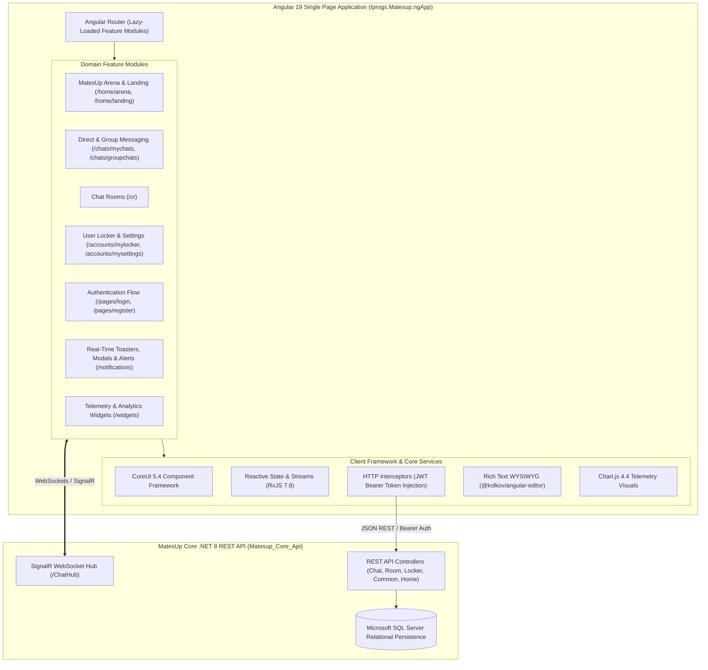

# MatesUp - Modern Angular Single Page Application (`MatesUp_Angular_App`)

## Overview

**MatesUp Angular App** (`MatesUp_Angular_App`) is the modernized Single Page Application (SPA) frontend for the **MatesUp** social networking and real-time community messaging platform.

Built with **Angular 19**, **TypeScript**, and **CoreUI 5.4**, this project represents the complete architectural modernization and decoupled frontend successor to the historical monolithic web application ([`Matesup_dotnet_legacy`](https://github.com/promodhvkumar/Matesup_dotnet_legacy)). It interfaces directly with the modernized .NET 8 backend engine ([`Matesup_Core_Api`](https://github.com/promodhvkumar/Matesup_Core_Api)) via high-throughput RESTful endpoints and real-time WebSocket communication, delivering responsive chatrooms, instant direct messaging, global community arena broadcasts, multimedia user lockers, and granular account privacy controls.

---

## Architectural Diagram



---

## Solution Structure & Projects

The repository is structured around a Visual Studio JavaScript/TypeScript Solution (`Iprogs.Matesup.ngApp.sln`) wrapping the complete Angular workspace:

```
MatesUp_Angular_App/
├── .gitignore                          # Standard Node, Angular, and IDE exclusions
├── Iprogs.Matesup.ngApp.sln            # Visual Studio Solution wrapper
├── LICENSE                             # Open Source License terms
├── README.md                           # Master architectural and technical specification
└── Iprogs.Matesup.ngApp/               # Angular Project Root
    ├── .editorconfig                   # Consistent indentation & encoding rules
    ├── angular.json                    # Angular CLI workspace build configurations & assets
    ├── package.json                    # Dependencies, build scripts, and engine specs
    ├── tsconfig.json                   # Root TypeScript compilation configuration
    ├── tsconfig.app.json               # Application-level TypeScript compilation
    ├── tsconfig.spec.json              # Jasmine/Karma unit testing TypeScript configuration
    ├── karma.conf.js                   # Unit testing test-runner harness
    └── src/
        ├── index.html                  # Single-page bootstrap HTML shell
        ├── main.ts                     # Application bootstrapping entrypoint
        ├── declarations.d.ts           # Ambient type declarations
        ├── scss/                       # Global modular styling & CoreUI overrides
        │   ├── _custom.scss            # Custom branding variables and typography
        │   ├── _theme.scss             # Light/Dark mode themes and color tokens
        │   └── styles.scss             # Global master stylesheet
        ├── assets/                     # Static media and vector graphics
        │   ├── brand/                  # MatesUp brand logos and CoreUI vector icons
        │   └── images/                 # Avatars and interface preview photography
        └── app/
            ├── app.component.*         # Master application shell and router outlet
            ├── app.config.ts           # Standalone providers, routing, and animations
            ├── layout/                 # Structural layouts (header, footer, sidebar)
            └── views/                  # Domain Feature Modules:
                ├── accounts/           # User profile vault, photo locker, and privacy settings
                │   ├── mylocker/       # Multimedia gallery vault and bio showcase
                │   ├── mysettings/     # Account preferences and demographic options
                │   └── routes.ts       # Accounts lazy routing table
                ├── chats/              # Real-time messaging hub
                │   ├── groupchats/     # Multiparty conversation channels
                │   ├── mychats/        # Direct one-on-one instant messaging threads
                │   ├── search/         # Member discovery and directory query
                │   └── routes.ts       # Chats lazy routing table
                ├── cr/                 # Active Chat Room canvas and interaction space
                │   ├── cr.component.*  # Real-time room chat UI, member roster, message feed
                │   └── routes.ts       # Chat Room route declarations
                ├── home/               # Public and social home experiences
                │   ├── arena/          # Global MatesUp Arena and megaphone broadcast feed
                │   ├── landing/        # Interactive marketing and feature introduction
                │   └── routes.ts       # Home routes configuration
                ├── pages/              # Authentication & Error canvases
                │   ├── login/          # Secure user credential verification
                │   ├── register/       # New user onboarding and profile registration
                │   ├── page404/        # Not-Found error view
                │   ├── page500/        # Internal server error view
                │   └── routes.ts       # Auth page routing table
                ├── notifications/      # Real-time notification system
                │   ├── alerts/         # Contextual alert notifications
                │   ├── badges/         # Status and count indicators
                │   ├── modals/         # Interactive confirmation and popup dialogs
                │   └── toasters/       # Dynamic transient toast notifications
                ├── widgets/            # Analytics and telemetry widgets
                │   ├── widgets-brand/  # Branded statistics cards
                │   └── widgets-dropdown/ # Interactive metric dropdowns
                ├── base/               # Reusable presentation controls (cards, navs, carousels)
                ├── buttons/            # Reusable button groups and dropdown triggers
                └── forms/              # Validated input controls, range sliders, and checks
```

---

## Technology Stack

| Layer / Concern | Technology | Description |
| :--- | :--- | :--- |
| **Framework** | Angular 19 (v19.2) | Modern, standalone component architecture with optimized hydration. |
| **Programming Language** | TypeScript 5.7+ | Strongly-typed ECMAScript with modern decorator and typing support. |
| **Component UI Toolkit** | CoreUI for Angular 5.4 | Enterprise administrative and client dashboard component suite. |
| **Reactive Programming** | RxJS 7.8 | Observable data streams, operators, and state subscriptions. |
| **CSS & Design System** | SCSS + Bootstrap 5 | Modular styling variables, responsive grids, and flexible layouts. |
| **Iconography** | FontAwesome 6 + CoreUI Icons | Scalable vector graphics and rich UI iconography. |
| **Rich Text Editor** | Angular Editor (`@kolkov/angular-editor`) | Integrated WYSIWYG editor for composing formatted messages. |
| **Data Visualization** | Chart.js 4.4 + `@coreui/angular-chartjs` | Responsive client-side chart rendering for activity telemetry. |
| **Toolchain & Bundler** | Angular CLI / Vite / esbuild | High-speed Ahead-Of-Time (AOT) compilation and bundling. |

---

## Core Domain Capabilities

1. **Real-Time Communication & Chat Rooms (`/cr`, `/chats`)**:
   * Synchronous peer-to-peer and community messaging backed by .NET 8 WebSockets.
   * Multi-tiered room browsing: public channels, password-protected rooms, and moderated spaces.
   * Dynamic member presence lists, instant typing indicators, and message history streaming.
2. **MatesUp Arena & Global Broadcasts (`/home/arena`)**:
   * Central platform hub displaying platform-wide megaphone announcements (`MegaPhoneMaster`).
   * Community bulletin board showcasing trending discussions, system bulletins, and live activity feeds.
3. **User Profile & Multimedia Locker (`/accounts/mylocker`)**:
   * Personal media vault allowing users to manage cover photos, avatar galleries, and biographical data.
   * Fully responsive media grids optimized for both mobile screens and desktop monitors.
4. **Granular Privacy & Account Settings (`/accounts/mysettings`)**:
   * Self-service management for passwords, contact visibility, geographic information (Country, State, City), and discovery preferences.
5. **Modern Authentication & Session Management (`/pages/login`, `/pages/register`)**:
   * Token-based authentication integration with client-side route guards (`authGuard`) safeguarding private views.
   * Form validation with real-time feedback for input errors, password strength, and registration rules.

---

## Development, Build & Execution

### Prerequisites
* [Node.js 20.x LTS](https://nodejs.org/)
* [npm](https://www.npmjs.com/) (v10+)
* [Angular CLI](https://angular.dev/tools/cli) (`npm install -g @angular/cli`)

### Local Setup & Development Server
1. Clone the repository:
   ```bash
   git clone https://github.com/promodhvkumar/MatesUp_Angular_App.git
   cd MatesUp_Angular_App/Iprogs.Matesup.ngApp
   ```
2. Install dependencies:
   ```bash
   npm install
   ```
3. Launch the development server:
   ```bash
   npm start
   # or
   ng serve -o
   ```
4. Navigate to `http://localhost:4200/` in your browser. The application will automatically reload if you change any of the source files.

### Production Build
To create a production-optimized distribution bundle:
```bash
npm run build
```
The compiled output will be generated inside the `dist/Iprogs.Matesup.ngApp/browser/` directory, ready for deployment to any static web host, CDN, Azure Static Web Apps, or IIS server.

### Running Unit Tests
Execute unit tests via Karma and Jasmine:
```bash
npm run test
```

---

## Architectural Parity & Lineage

* **Predecessor**: [`Matesup_dotnet_legacy`](https://github.com/promodhvkumar/Matesup_dotnet_legacy) — Historical .NET 4.6.1 monolith with AngularJS 1.x.
* **Modern Backend Companion**: [`Matesup_Core_Api`](https://github.com/promodhvkumar/Matesup_Core_Api) — High-throughput ASP.NET Core 8 Web API and SignalR Hub.